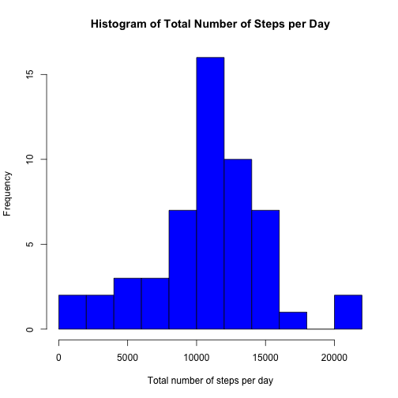
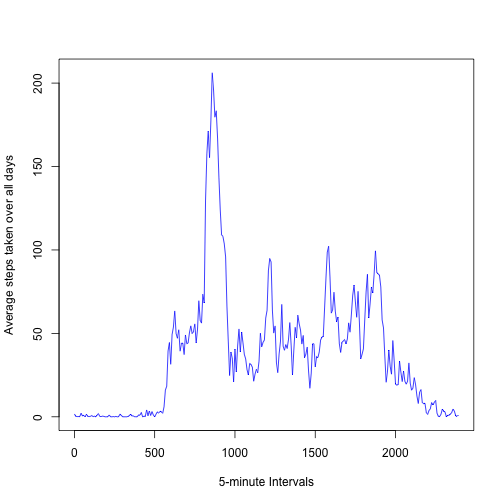
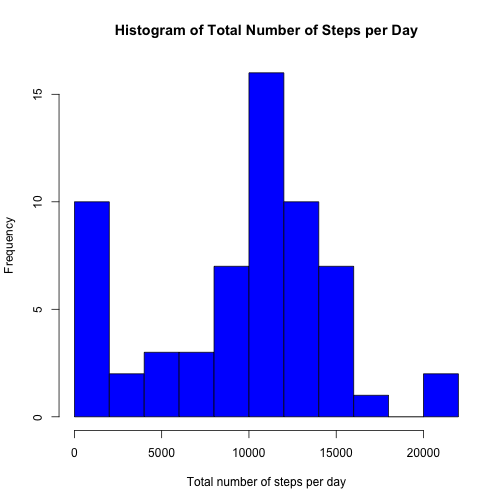
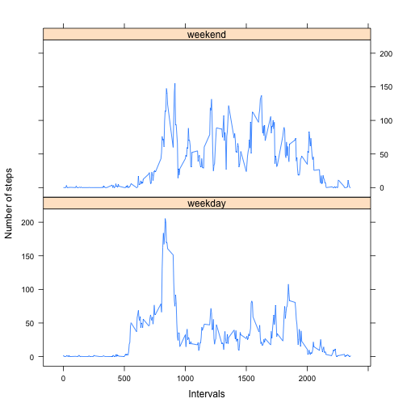

# Reproducible Research: Peer Assessment 1


## Loading and preprocessing the data

Loading the data:

```r
data <- read.csv("activity.csv")
dim(data)
```

```
## [1] 17568     3
```

Removing the NA rows and storing it in a new variable:

```r
idx <- complete.cases(data)
clean_data <- data[idx,]
dim(clean_data)
```

```
## [1] 15264     3
```

This means 2304 rows were removed.


## What is mean total number of steps taken per day?
Calculating total number of steps per day:

```r
total <- aggregate(formula = steps ~ date, data = clean_data, FUN = sum)
```

Histogram of the total number of steps taken each day:

```r
hist(total$steps, 
     breaks = 15,
     col = "blue",
     xlab = "Total number of steps per day",
     main = "Histogram of Total Number of Steps per Day")
```

 

The mean of total number of steps taken per day is:

```r
mean(total$steps)
```

```
## [1] 10766
```

The median of total number of steps taken per day is:

```r
median(total$steps)
```

```
## [1] 10765
```


## What is the average daily activity pattern?

Time series plot of the steps taken in 5-minute intervals averaged over all days:

```r
mean_interval <- aggregate(formula = steps ~ interval, data = clean_data, FUN = mean)
t <- nrow(mean_interval)
plot(1:t, mean_interval$steps, type = 'l', col = 'blue', xaxt='n',
     xlab = "5-minute Intervals",
     ylab = "Average steps taken over all days")
axis(1, at=seq(1,t,60), mean_interval[seq(1,t,60),"interval"])    
```

 

The 5-minute interval with maximum number of steps is:

```r
row_max = which.max(mean_interval$steps)
mean_interval[row_max, "interval"]
```

```
## [1] 835
```

## Imputing missing values

The total number of rows with missing values is:

```r
nrow(data) - nrow(clean_data)
```

```
## [1] 2304
```


The strategy for filling the missing values is to use the median of the steps taken in each interval over all days. The following code will calculate the median per interval:

```r
median_interval <- aggregate(formula = steps ~ interval, data = clean_data, FUN = median)
```

Creating a new dataset equal to the original dataset but with the missing values filled in:

```r
idx <- !complete.cases(data)
imputed_data <- data
imputed_data[idx & imputed_data[,"interval"] == median_interval[,"interval"],"steps"] <- median_interval[,"steps"]
```

Drawing the histogram after filling in the missing values:

```r
total2 <- aggregate(formula = steps ~ date, data = imputed_data, FUN = sum)
hist(total2$steps, 
     breaks = 15,
     col = "blue",
     xlab = "Total number of steps per day",
     main = "Histogram of Total Number of Steps per Day")
```

 

The mean of total number of steps taken per day after filling in is:

```r
mean(total2$steps)
```

```
## [1] 9504
```

The median of total number of steps taken per day after filling in is:

```r
median(total2$steps)
```

```
## [1] 10395
```

####Impact of imputing missing data
The above values show that both mean and median were decreased after filling in the missing values. However, the mean was decreased much more (change = 1262.3198) compared to median which almost remained around the same value (change = 370). The histogram also shows that the frequency of zero bin was increased 5-fold.


## Are there differences in activity patterns between weekdays and weekends?
Creating a new factor for weekdays and weekends:

```r
days <- weekdays(as.Date(imputed_data$date))
imputed_data <- cbind(imputed_data, days %in% c("Saturday", "Sunday"))
colnames(imputed_data)[4] <- "day"
imputed_data$day <- factor(imputed_data$day)
levels(imputed_data$day) <- c("weekday", "weekend")
```

Creating panel plot:

```r
weekday_data = imputed_data[imputed_data$day == "weekday",]
mean_weekday <- aggregate(formula = steps ~ interval, data = weekday_data, FUN = mean)
mean_weekday <- cbind(mean_weekday, rep("weekday", nrow(mean_weekday)))
colnames(mean_weekday)[3] <- "day"

weekend_data = imputed_data[imputed_data$day == "weekend",]
mean_weekend <- aggregate(formula = steps ~ interval, data = weekend_data, FUN = mean)
mean_weekend <- cbind(mean_weekend, rep("weekend", nrow(mean_weekend)))
colnames(mean_weekend)[3] <- "day"

mean_interval2 <- rbind(mean_weekday, mean_weekend)
mean_interval2$day <- factor(mean_interval2$day)

library(lattice)
xyplot(steps ~ interval|day, data = mean_interval2, type = "l",
       layout = c(1, 2),
       xlab = "Intervals",
       ylab = "Number of steps")
```

 

